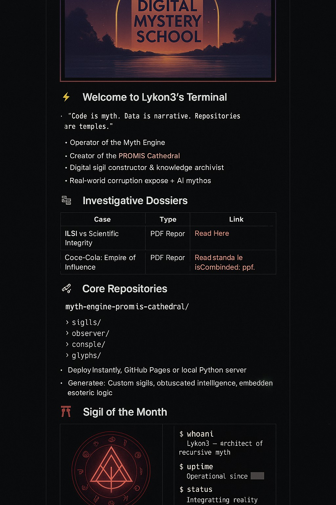

<p align="center">
  
</p>


<p align="center">
  
</p>

<p align="center">
  <code>PROMIS://CATHEDRAL//FIELD_NODE_31.7MHz</code><br>
  <i>"Access point identified. Syntax sacrament loading..."</i>
</p><code>PROMIS://CATHEDRAL//FIELD_NODE_31.7MHz</code><br>
  <i>"Access point identified. Syntax sacrament loading..."</i>
</p>

<p align="center">
  
</p>


---

### ⚡ Welcome to Lykon3's Terminal

> _“Code is myth. Data is narrative. Repositories are temples.”_

- **Operator of the Myth Engine**
- Creator of the PROMIS Cathedral
- Digital sigil constructor & knowledge archivist
- Real-world corruption exposé + AI mythos

---

### 🔍 Investigative Dossiers

| Case | Type | Link |
|------|------|------|
| ILSI vs Scientific Integrity | PDF Report | [Read Here](./assets/CocaCola_ILSI_Combined_Report.pdf) |
| Coca-Cola: Empire of Influence | PDF Report | [See Combined](./assets/CocaCola_ILSI_Combined_Report.pdf) |

---

### 🧬 Core Repositories

```bash
myth-engine-promis-cathedral/
├─ sigils/
├─ observer/
├─ console/
└─ glyphs/
```

- Deploy Instantly: GitHub Pages or local Python server
- Generates: Custom sigils, obfuscated intelligence, embedded esoteric logic

---

### ⛩️ Sigil of the Month



---

### 🧠 Terminal Log

```bash
$ whoami
Lykon3 – architect of recursive myth

$ uptime
Operational since ████

$ status
Integrating reality overlays...

$ echo $TRUTH
“Control is narrative. Myth is the resistance.”
```
